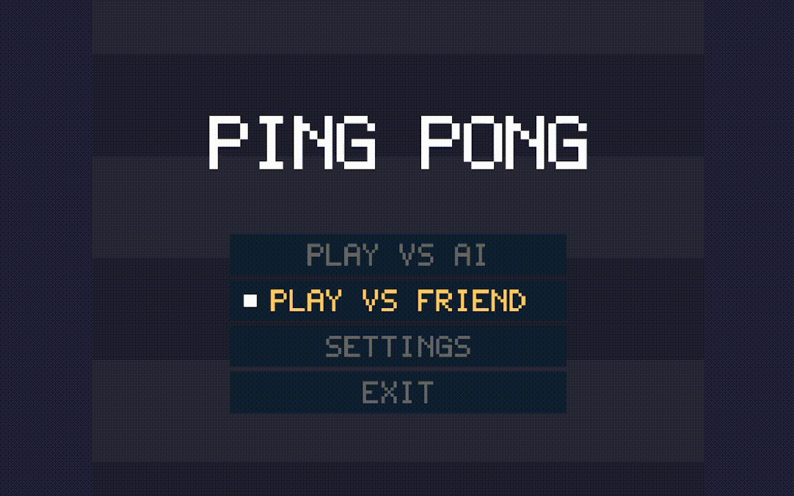
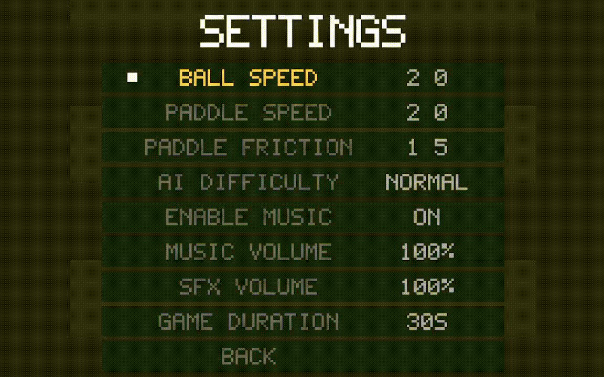
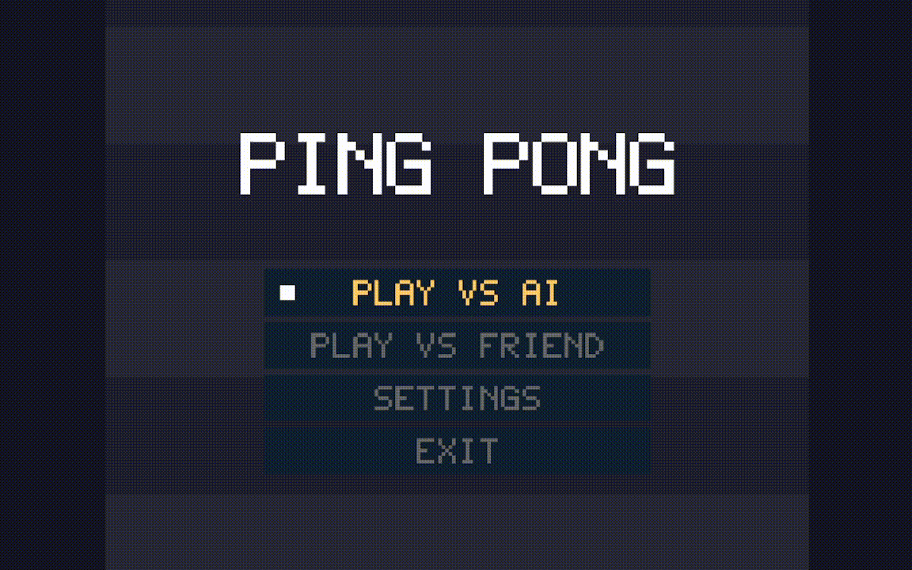
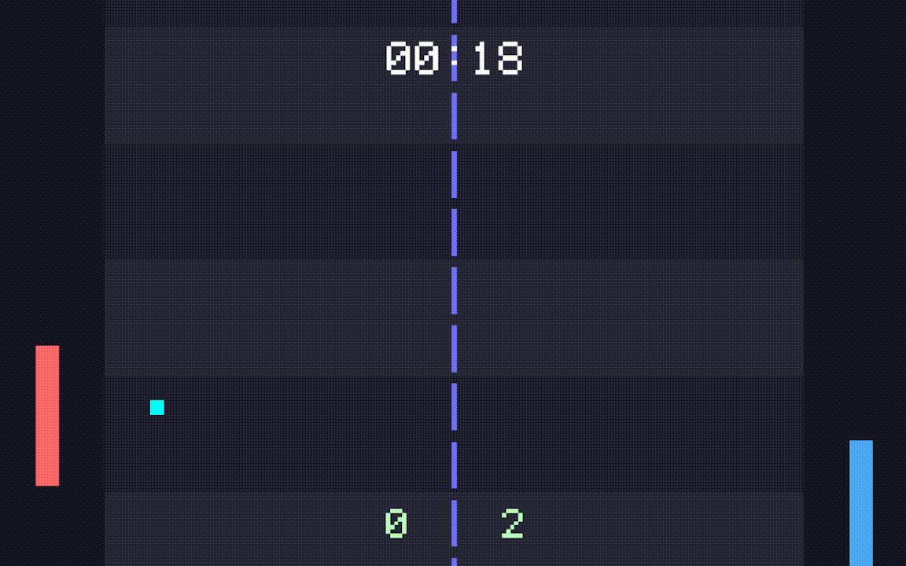

# 🏓 PingPong  

**A fast, modern, and minimal C++ Ping Pong game built entirely in a single header and a main file.**  
Crafted for speed, clarity, and retro charm — no external graphics libraries, just pure Win32 and GDI magic.

---

## ✨ Overview  

**PingPong** is a lightweight 2D game written in **modern C++** using the **Win32 API** directly.  
It demonstrates how to build a complete, interactive, and visually sleek desktop game from scratch with clean architecture and efficient rendering — ideal for learning low-level graphics programming or showcasing game development craftsmanship.

---

## 🎮 Features  

- ⚡ **Smooth gameplay** — optimized frame timing and real-time control  
- 🧠 **AI opponent** — dynamic paddle movement and realistic response  
- 🎨 **Custom UI system** — buttons, menus, and text drawn via Win32 GDI  
- 🧩 **Single-header design** — clean, modular, and easy to include  
- 💡 **Low-level Win32 rendering** — no external dependencies  
- 🎵 **Ready for sound integration** (expandable)  
- 🕹️ **Responsive controls** — tight player feedback loop  
- 🌈 **Professional architecture** — modern C++ code structure  

---

## 🧱 Project Structure  

```plaintext
│   after-installation-info.txt
│   before-installation-info.txt
│   build.bat
│   license.txt
│   main.cpp
│   app.exe
│   README.md
│   website.html
│
├───assets
│   ├───icon
│   │       app.ico
│   │
│   ├───music
│   │       music.mp3
│   │
│   └───sfx
│           button.mp3
│           button_back.mp3
│           countdown_tick.mp3
│           game_timer_tick.mp3
│           go_tick.mp3
│           navigation.mp3
│           paddle_hit.mp3
│           setting.mp3
│           shine.mp3
│           winner.mp3
│
├───config
│       config.json
│       default.json
│
├───include
│       game.hpp
│
├───rsc
│       app.rc
│       app_res.o
│       resource.h
│
├───screenshots
│       gameplay.gif
│       main-menu.png
│       settings.png
│
└───third_party
        json.hpp
        json_fwd.hpp
        miniaudio.h
```

---

## 🧠 Controls

| Action       | Key                |
|--------------|--------------------|
| Player 1 Up  | `W` / `Z` (AZERTY) |
| Player 1 Down | `S`               |
| Player 2 Up  | Up Arrow           |
| Player 2 Down | Down Arrow         |
| Navigate Menus | Up / Down Arrows  |
| Change Settings| Left / Right Arrows |
| Select / Confirm | Enter            |
| Back         | Esc             |

---

## ⚙️ Build Instructions  

**Requirements:**
- Windows OS  
- C++23 or higher  
- MinGW, Visual Studio, or Clang toolchain  

### 🧩 Build using `build.bat`
Simply double-click `build.bat` or run it from the terminal:
```bash
build.bat
```

### Manual build (example using MinGW / g++)
```bash
g++ main.cpp app_res.o -o pingpong.exe -luser32 -lgdi32 -std=c++23
```

## 🧭 Technical Highlights

- **Single-header architecture** — easy to inspect, include, and modify.  
- **Win32 / GDI based rendering** — no external graphics frameworks.  
- **Custom pixel font renderer** — draws crisp retro text without bitmap assets.  
- **Modular namespaces** — `render`, `input`, `objects`, `ui`, `window`.  
- **Deterministic game loop** — uses `QueryPerformanceCounter` for accurate `dt`.  

---

## ⚙ Settings (menu)

Settings are available in the menu and include:

- **Ball Speed** — configurable multiplier for ball velocity  
- **Paddle Speed** — tuning for paddle responsiveness  
- **Paddle Friction/Damping** — configurable paddle friction rate
- **AI Difficulty** — selectable levels (Easy / Normal / Hard)  
- **Enable Music** — whether to play music or not
- **Music Volume** — adjustable music volume (0 to 100%)
- **SFX Volume** — increasing or decreasing the sound effects volume like button clicking, navigation...etc
- **Game Duration** — adjusting the duration of each game (until game says the winner)

Use **Left/Right arrows** to change values and **Enter** to confirm or go back.

---

## 🧩 Roadmap

- [x] Add sound effects and background music  
- [x] Local config persistence  
- [x] More polished menu transitions & animations  
- [ ] Local multiplayer / shared keyboard improvements
- [ ] Theme support (retro neon, dark/light)

---

## 📸 Screenshots

### 🎮 Main Menu:


### ⚙  Settings:


### 🕹 Gameplay:


### ⏸ Pause Menu:


---

## 👤 Author

**Zakaria Aliliche**  
C++ developer focused on low-level graphics, performance, and clean architecture.  
GitHub: [https://github.com/Mono404Fun](https://github.com/Mono404Fun)

---

## ⚖️ License

This project is released under the **MIT License**.

> MIT License © 2025 Zakaria Alilich

---

## 💬 Contributing

Contributions, bug reports, and suggestions are welcome. Suggested workflow:

1. Fork the repo  
2. Create a feature branch (`feature/my-change`)
3. Make changes & test locally  
4. Open a pull request with a short description and screenshots (if applicable)

---

## 🧠 Acknowledgments

- Inspired by the original **Pong** concept — minimal, elegant gameplay.  
- Built from scratch to demonstrate how to combine modern C++ and Win32 APIs for small game projects.

---

## 🏁 Final Note

> “Simplicity is not absence of complexity — it is clarity of design.”
